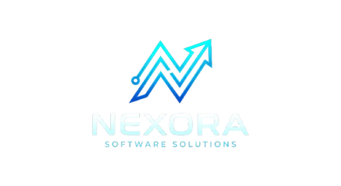

# SOFTWARE HANDOVER & PROJECT ACCEPTANCE AGREEMENT

  

**Document Reference:** `NXR-AGR-2026-LP01`  
**Date of Agreement:** `____ / ____ / 2026`  

---

## 1. PARTIES INVOLVED

This Software Handover and Acceptance Agreement (the **"Agreement"**) is entered into by and between:

| **Service Provider (Developer)** | **Client (Purchaser)** |
| :--- | :--- |
| **Company:** Nexora Software Solutions | **Company:** Sadhan Apex (Pvt) Ltd |
| **Representative:** _______________________________ | **Representative:** _______________________________ |
| **Designation:** __________________________________ | **Designation:** __________________________________ |
| **NIC / Passport No:** ___________________________ | **NIC / Passport No:** ___________________________ |
| **Contact Number:** ______________________________ | **Contact Number:** +94 76 108 3008 / ____________ |
| **Email Address:** _______________________________ | **BRN (Reg No):** ________________________________ |
| **Address:** ______________________________________ | **Address:** ______________________________________ |

---

## 2. PROJECT OVERVIEW

- **Project Name:** SADHAN APEX (PVT) LTD
- **Backend API URL:** Hosted on Render Cloud (`____________________________________`)
- **Database System:** PostgreSQL Cloud Database (Neon Serverless)
- **Primary Business Logic:** 58-installment daily microfinance loan issuance, automated cycle penalty calculation, real-time field collections tracking, and mobile POS thermal receipt generation.

---

## 3. SCOPE OF DELIVERABLES & FUNCTIONAL SPECIFICATIONS

The system has been developed, tested, and deployed to production. Below is the functional scope delivered:

### A. Core Loan Management Engine (58-Installment Model)
- **Flat 8% Interest Calculation:** Computes standard loan terms based on principal and fixed 8% interest rate.
- **58-Day Repayment Lifecycle:** Automatic generation of 58 scheduled daily installment records upon loan creation.
- **Top-Up & Adjustment:** Capability for administrators to top-up active loans and adjust principal/interest with real-time recalculation of remaining balance.
- **Status Workflows:** Automated state transitions across `ACTIVE`, `OVERDUE`, `PENALTY`, and `COMPLETED`.

### B. Automated 58-Cycle Compounding Penalty Engine
- **Autonomous Penalty Application:** Eliminates manual penalty triggering by automatically applying an 8% overdue surcharge every 58 installments (cycles) if a loan remains unpaid.
- **Compounding Cycle Support:** Automatically handles extended overdue durations (Cycle 1 at 58 days, Cycle 2 at 116 days, Cycle 3 at 174 days, etc.).
- **Remaining Balance Recalculation:** Penalties are accurately calculated as 8% of the remaining outstanding balance at that cycle and added to the principal balance.
- **Audit Logging:** System automatically logs penalty history, penalty counts, and notifies collectors.

### C. Field Collections Queue & Real-Time Reminders
- **Priority Queue 1 — Scheduled For Today:** Dedicated top-section highlighting all accounts due today, displaying today's installment and any accumulated past arrears.
- **Priority Queue 2 — Overdue Accounts:** Single consolidated record per borrower showing days late, missed installment count, overdue start date, and total amount to pay to date.
- **Priority Queue 3 — 58-Day Limit Exceeded Penalties:** Highlights defaulted/penalized accounts with overdue window and remaining balance.
- **Timezone Synchronization:** Deterministic calculation using Sri Lanka Time (`Asia/Colombo`, UTC+5:30) ensuring zero calendar day offset errors.

### D. Payments & Thermal POS Receipts
- **Waterfall Payment Distribution:** Applies full and partial payments sequentially from oldest unpaid installments to newest.
- **Pre-filled Arrears Settlement:** One-click "Collect & Print" button automatically pre-fills the total amount needed to clear the borrower's account to date while supporting partial custom amounts.
- **Thermal Receipt Printing:** Generates formatted 58mm ESC/POS compatible receipts with direct Bluetooth printer app sharing and AirPrint support.
- **Receipt Transparency:** Itemizes payment breakdown, remaining balance, penalty count/details, and clean date-only next due date.

### E. Client Management & Verification
- **Mandatory NIC / Identity Verification:** Enforced national identity card validation upon client onboarding.
- **Borrower Directory:** Searchable directory with direct phone calling, location details, active loans, and repayment history.

### F. Reports, Financial Ledger & Smart TV Monitor Mode
- **Daily Collection Ledger:** Real-time summary of expected collections, collected cash, outstanding arrears, and collector performance.
- **Client Ledger Audit:** Comprehensive chronological repayment history and transaction receipts.
- **Smart TV Wall Monitor:** Dedicated auto-refreshing (every 15s) display mode optimized for 1080p and 4K office wall monitors.
- **Role-Based Access Control (RBAC):** Distinct permissions and UI controls for Business Owner vs Field Collection Agents.

---

## 4. SYSTEM ARCHITECTURE & HOSTING

| Layer | Technology | Hosting Provider | Deployment Status |
| :--- | :--- | :--- | :--- |
| **Frontend UI** | React 18, Vite, Lucide Icons, Vanilla CSS | Netlify | Production Active |
| **Backend API** | Node.js, Express.js, REST API | Render | Production Active |
| **Database** | PostgreSQL (Relational Engine) | Neon.tech Cloud | Production Active |
| **Code Repository** | Git / GitHub Version Control | GitHub (`Hasitha-D/loanpro-manager`) | Up to Date |

---

## 5. FINANCIAL TERMS & PAYMENT SCHEDULE

1. **Total Agreed Project Value:** Rs. _________________________ (LKR)
2. **Advance / Initial Deposit Paid:** Rs. _________________________ (LKR)
   - Date of Advance Payment: `____ / ____ / 2026`
3. **Milestone / Intermediate Payments:** Rs. _________________________ (LKR)
   - Date of Payment: `____ / ____ / 2026`
4. **Final Settlement Amount Due:** Rs. _________________________ (LKR)
   - Due Date / Upon Sign-off: `____ / ____ / 2026`
5. **Payment Method:** `[  ] Cash   [  ] Bank Transfer   [  ] Cheque`
   - Bank Details for Transfer: __________________________________________________

---

## 6. WARRANTY, MAINTENANCE & SUPPORT

1. **Free Support & Bug Fix Period:** 
   - The Service Provider provides **______ months** of complimentary technical support and bug fixing commencing from the date of this signed agreement.
2. **Exclusions from Free Warranty:**
   - Feature requests, workflow alterations, and brand new functional modules not defined in Section 3 will be quoted separately.
   - Database/cloud hosting fees (e.g. Render, Netlify, Neon domain/server tiers) after trial quotas expire remain the responsibility of the Client.
3. **Post-Warranty Annual Maintenance (Optional):**
   - Maintenance Fee: Rs. ____________________ per year / month (optional).

---

## 7. INTELLECTUAL PROPERTY & DATA PRIVACY

1. **Ownership of Software:** Upon full settlement of the Total Agreed Project Value, the Client is granted an exclusive, perpetual license to use the deployed software for their microfinance operations.
2. **Client Data Confidentiality:** All client financial records, borrower personal data (NICs, contact details), and payment ledgers remain the exclusive, confidential property of **Sadhan Apex (Pvt) Ltd**. The Service Provider shall not disclose or distribute this data to any third party.

---

## 8. FORMAL ACCEPTANCE & SIGN-OFF

By signing below, the Client confirms that:
1. The software features detailed in Section 3 have been reviewed, tested, and accepted as functioning satisfactorily.
2. Live production credentials and administrative access have been received.
3. The project handover is officially accepted.

 

| **For: Nexora Software Solutions** *(Service Provider)* | **For: Sadhan Apex (Pvt) Ltd** *(Client)* |
| :--- | :--- |
|   _________________________________________ **Authorized Signature** |   _________________________________________ **Authorized Signature** |
| **Name:** ___________________________________ | **Name:** ___________________________________ |
| **Designation:** ____________________________ | **Designation:** ____________________________ |
| **Date:** `____ / ____ / 2026` | **Date:** `____ / ____ / 2026` |
|  **Company Seal / Stamp:**    |  **Company Seal / Stamp:**     |
